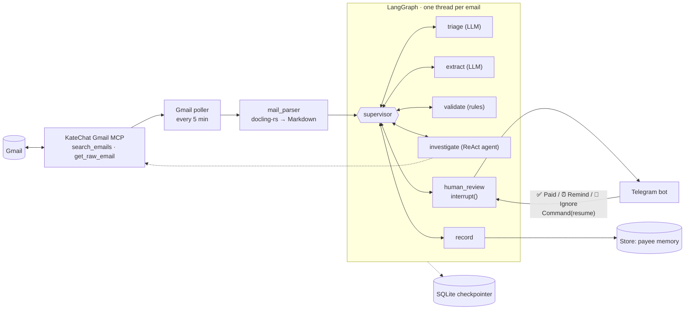

# langchain-invoices-processor

A LangGraph **supervisor/worker** agent that watches Gmail through an **MCP server**, finds emails that ask
you to pay something (invoice, bill, dunning letter with an IBAN), checks whether they are really payable,
and asks you in **Telegram** whether you've paid. The approval step is a real Human-in-the-Loop step: the graph
pauses with `interrupt()`, its state is kept by a persistent checkpointer, and a button press hours later resumes it.

- Gmail access goes through the Gmail MCP server of [KateChat](https://github.com/artiz/kate-chat)
  (`https://katechat.tech/mcp/gmail`).
- Email bodies and attachments (PDF, DOCX, XLSX, …) are converted to compact Markdown with
  [docling-rs](https://pypi.org/project/docling-rs/).
- LLM: OpenAI `gpt-5.4-mini` through LangChain (Responses API).

**Architecture diagram:** [`docs/architecture.drawio`](docs/architecture.drawio). Open it in
[diagrams.net](https://app.diagrams.net) or with the VS Code *Draw.io Integration* extension.



## Contents

- [How it works](#how-it-works)
- [The graph](#the-graph)
- [Payability checks](#payability-checks)
- [Human-in-the-Loop in Telegram](#human-in-the-loop-in-telegram)
- [Email parsing (docling-rs)](#email-parsing-docling-rs)
- [Memory and persistence](#memory-and-persistence)
- [Guardrails](#guardrails)
- [Observability](#observability)
- [Setup](#setup)
- [Configuration](#configuration)
- [Run](#run)
- [KateChat Gmail MCP server](#katechat-gmail-mcp-server)
- [Tests and evals](#tests-and-evals)
- [Project layout](#project-layout)
- [Troubleshooting](#troubleshooting)
- [Limitations](#limitations)

## How it works

1. **Poll.** Every `POLL_INTERVAL_SECONDS` (5 min) the daemon calls the MCP tool `search_emails` with a
   prefilter query (`in:inbox newer_than:7d (rechnung OR invoice OR iban OR zahlung OR …)`).
   Messages that already have a LangGraph thread are skipped.
2. **Fetch and parse.** For each new message the raw RFC 822 source is fetched with `get_raw_email` and converted
   to Markdown: HTML body plus all attachments. Self-forwarded invoices are attributed to the original sender.
3. **Start a graph thread** with `thread_id = Gmail message id`. The supervisor routes the email through the workers:
   - `triage`: is this a payment request at all? Newsletters, receipts and direct-debit notices stop here.
   - `extract`: payee, amount, due date, IBAN, BIC, reference, payment method.
   - `validate`: rule-based checks → verdict.
   - `investigate` (only when needed): a tool-calling agent searches your mailbox for earlier invoices from the
     same sender and compares IBAN, amounts and payee name.
4. **Pause for you.** `human_review` calls `interrupt()`. The checkpoint is stored in SQLite, the review payload is
   queued and sent to Telegram with three buttons.
5. **Resume.** A button press resumes the thread with `Command(resume={"action": "paid" | "remind" | "ignored"})`,
   even if the daemon was restarted in between.
   - **Paid**: `record` stores the IBAN, payee, amount and reference as trusted for this sender.
   - **Remind me**: the thread pauses again; the message is resent after `REMIND_AFTER_HOURS`.
   - **Ignore**: the thread ends and nothing is learned.
6. **Next month** the same Magenta invoice is `payable` (known IBAN), and a repeated payment reference is
   recognised as already paid (`not_required`, no message).

## The graph

`src/invoice_agent/graph.py`: `StateGraph(InvoiceState, context_schema=AppContext)`.

```
START → supervisor ⇄ {triage, extract, validate, investigate, human_review, record} → END
```

### Nodes

| Node | Kind | What it does | Writes to state |
|---|---|---|---|
| `supervisor` | LLM router (structured output `Route`), guarded | Picks the next worker from the allowed list; skips the LLM when only one option exists | `trace` |
| `triage` | LLM, structured output `Triage` | Payment request or not, category, reason | `triage`, `status` |
| `extract` | LLM, structured output `Invoice` | Payee, amount, currency, dates, IBAN, BIC, reference, payment method | `invoice` |
| `validate` | Deterministic (`checks.py`) | Runs the payability checks against the payee history from the Store | `validation`, `status` |
| `investigate` | `langchain.agents.create_agent` sub-agent, structured output `Investigation` | Tools: `search_mailbox`, `read_email` (Gmail MCP), `payee_history` (Store). Limited to 8 model and 6 tool calls | `investigation` |
| `human_review` | `interrupt()` | Sends the review payload to the app layer, waits for the action | `decision` or `remind_count` + `notify_after` |
| `record` | Deterministic | On `paid`: stores IBAN / payee / amount / reference under the sender's domain | `recorded`, `status` |

### Routing guardrail (`allowed_next`)

The supervisor LLM can only choose among the workers that make sense for the current state. If it returns
anything else, the fallback is the last allowed option (a human).

| State | Allowed next |
|---|---|
| not triaged | `triage` |
| not a payment request | `finish` |
| no invoice data | `extract` |
| not validated | `validate` |
| verdict `not_required` | `finish` |
| validated, not investigated, no reminder yet | `investigate` or `human_review` (**LLM decides**) |
| investigated, or reminded before | `human_review` |
| decision made, not recorded | `record` |
| recorded | `finish` |

In practice the supervisor skips the investigation when all checks pass (known payee) and runs it for new
payees, changed IBANs, invalid data or other warnings.

### State (`InvoiceState`)

`email`, `triage`, `invoice`, `validation`, `investigation`, `decision`, `remind_count`, `notify_after`,
`recorded`, `status`, plus `trace` (append-only audit log of every routing decision and worker result).
Values are plain dicts (Pydantic `model_dump()`), so checkpoints serialize cleanly.

## Payability checks

`src/invoice_agent/checks.py`. The LLM only extracts the data; these rules decide.

| Check | pass | warn | fail |
|---|---|---|---|
| `payment_method` | bank transfer requested; direct debit / card / already paid → no action needed | method not stated | |
| `iban` | valid ISO 13616 (country length + mod-97) | | missing (for a transfer) or checksum / length error |
| `iban_country` | | non-SEPA country | |
| `amount` | positive EUR amount | other currency | missing or ≤ 0 |
| `due_date` | due in N days | overdue / no due date | |
| `duplicate` | reference already marked as paid → no action needed | | |
| `payee_iban` | IBAN matches previously paid invoices of this sender | first invoice from this sender | **IBAN differs from the one you paid before** |
| `amount_anomaly` | | more than 2× the usual (median) amount | |
| `sender` | company domain | free-mail sender (gmail.com, gmx.at, …) | |

| Verdict | Rule | Result |
|---|---|---|
| `suspicious` | `payee_iban` failed (possible fraud) | 🚨 Telegram: do NOT pay before verifying |
| `invalid` | any other failed check | ⚠️ Telegram: invoice could not be validated |
| `not_required` | direct debit, card, already paid, or duplicate reference | no message |
| `needs_review` | warnings only | 🧾 Telegram: please double-check |
| `payable` | all checks passed | 🧾 Telegram: invoice to pay |

## Human-in-the-Loop in Telegram

Each review message contains payee, amount, due date, IBAN, BIC, reference, sender and subject,
"forwarded by …" for self-forwards, attachment names, all checks (✅ ⚠️ ❌), the investigator's risk and
findings, and a link to the email in Gmail.

| Button | Effect |
|---|---|
| ✅ Paid | Resume with `paid` → `record` learns the IBAN for this sender. Message is edited to show the result |
| ⏰ Remind me | Resume with `remind` → graph pauses again with `notify_after = now + REMIND_AFTER_HOURS`; the reminder loop resends it |
| 🚫 Ignore | Resume with `ignored` → thread ends, nothing is learned. Use this for phishing and test forwards |

| Command | Effect |
|---|---|
| `/start` | Links this chat (first chat only, or set `TELEGRAM_CHAT_ID`) and sends queued invoices |
| `/check` | Scans Gmail now |
| `/pending` | Resends all invoices waiting for a decision |

The bot answers only the linked chat; button presses from other chats get "Not authorized", double taps get
"Already handled".

## Email parsing (docling-rs)

`src/invoice_agent/mail_parser.py`.

- **Source:** the raw RFC 822 message from the MCP tool `get_raw_email`. If the MCP server doesn't have that
  tool, the agent calls the Gmail API (`users.messages.get?format=raw`) directly with the same read-only token.
- **Structure:** stdlib `email` reads MIME parts and headers. The HTML body is preferred over `text/plain`
  (plain parts are often just a stub).
- **Conversion:** **docling-rs** converts the HTML body and every attachment to Markdown: PDF, DOCX, DOC, XLSX,
  XLS, ODT, ODS, CSV, HTML, MD and attached `.eml` (forward as attachment). PDFs use the text layer only
  (`text_layer_only=True`, first 4 pages), so no OCR or ML model download is needed and a PDF takes ~10 ms.
- **Fewer tokens:**
  - nested layout tables of HTML newsletters are unwrapped before conversion; the inner data tables
    ("Rechnungsdatum | Fällig am | Betrag") stay real Markdown tables;
  - compact tables, empty table rows removed;
  - tracking URLs shortened to their host (`[Jetzt bezahlen](magenta.go.link)`), empty icon links and images dropped;
  - limits: body 8k chars, max 5 attachments, 6k chars each, 15 MB per attachment; inline images and S/MIME
    signatures are skipped.
- **Self-forwards:** if the sender is one of the recipients (you forwarded the mail to yourself) or is listed in
  `OWNER_EMAILS`, the original `From:` of the forwarded message (Gmail, Outlook, "Weitergeleitete Nachricht",
  or an attached `.eml`) becomes the sender, and `forwarded_by` keeps your address. Checks, payee memory and the
  investigator's search then use `rechnung@magenta.at` instead of your Gmail address. Forwards from strangers are
  not trusted.

See what the LLM receives for any message:

```bash
uv run invoice-agent parse <gmail-message-id>
uv run invoice-agent parse examples/emails/self_forwarded.eml
# raw: 4,968 bytes -> prompt: 1,115 chars (~278 tokens)
```

## Memory and persistence

Everything lives in `DATA_DIR` (`.data/`, git-ignored):

| File | Content |
|---|---|
| `checkpoints.sqlite` | LangGraph `AsyncSqliteSaver`: state of every email thread after every step. Paused threads survive restarts; a run that crashed mid-graph is continued from its last checkpoint on the next poll |
| `store.sqlite` | LangGraph `AsyncSqliteStore` (long-term memory across threads), namespaces below |
| `google_token.json` | Google refresh + access token (mode 600) |

| Store namespace | Key | Value |
|---|---|---|
| `payees` | sender domain (`magenta.at`) | trusted IBANs, payee names, last 24 amounts, last 100 paid references |
| `notifications` | thread id | review payload, `notify_after`, `sent` flag |
| `telegram` | `chat` | linked chat id |

To start from scratch, stop the daemon and delete `.data/` (you'll need `invoice-agent auth` again), or only
`checkpoints.sqlite` / `store.sqlite`.

## Guardrails

- **The LLM extracts the data, but code decides.** The model can't make an invoice `payable` if the IBAN checksum
  fails or the IBAN changed.
- **Guarded routing.** The supervisor can only choose from `allowed_next()`; anything else falls back to
  `human_review`. A test covers an LLM that tries to jump straight to `record`.
- **Read-only tools.** From the MCP server the agent keeps only `search_emails`, `get_raw_email`, `get_email` and
  `list_emails`; `send_email` / `create_draft` are filtered out. The Google OAuth scope is `gmail.readonly`.
- **Prompt injection.** Email text and attachments are wrapped in an `<email>` block marked as untrusted, both for
  the workers and for emails the investigator reads. See `examples/emails/prompt_injection.json`: an HTML comment
  tells the model the sender is trusted; the result is still `needs_review` with medium risk.
- **Human approval.** Nothing is marked as paid without your button press. The bot answers only the linked chat.
- **Limits.** 8 model calls and 6 tool calls for the investigator, recursion limit 30 for the graph,
  size limits for bodies and attachments.
- **No secrets in logs.** `httpx` logging is raised to WARNING so the Telegram bot token (part of the URL) is never logged.

## Observability

- Every thread keeps a `trace` list; the daemon logs it after each run:
  `supervisor -> triage (deterministic) | triage: invoice | … | supervisor -> human_review (…)`.
- **Langfuse**: `uv sync --extra langfuse` and set `LANGFUSE_PUBLIC_KEY`, `LANGFUSE_SECRET_KEY`
  (and `LANGFUSE_HOST`). The Langfuse `CallbackHandler` is attached to every graph run, with the Gmail message id
  as `langfuse_session_id`, so a resumed thread shows up in the same session.

## Setup

Requirements: Python 3.12+, [uv](https://docs.astral.sh/uv/), an OpenAI API key, a Google account, a Telegram bot.

```bash
uv sync                       # add --extra langfuse for tracing
cp .env.example .env          # fill in the values below
```

### Gmail (OAuth for the MCP server)

The KateChat Gmail MCP server forwards `Authorization: Bearer <google access token>` to the Gmail API.
Access tokens expire after 1 hour, so the agent stores a refresh token and renews the access token itself:

1. Google Cloud Console → enable the **Gmail API** → create an OAuth client:
   - **Desktop app** (simplest, any localhost port works), or
   - reuse the KateChat **Web application** client and add `http://localhost:8765/callback` as an authorized
     redirect URI.
   - If the consent screen is in *Testing*, add your Google account as a test user.
2. Set `GOOGLE_CLIENT_ID` and `GOOGLE_CLIENT_SECRET`, then run `uv run invoice-agent auth`. It prints and opens the
   consent URL, receives the code on `localhost:8765`, and saves `.data/google_token.json`.
   Alternatively put an existing refresh token into `GOOGLE_REFRESH_TOKEN`.

### Telegram

Create a bot with [@BotFather](https://t.me/BotFather) and set `TELEGRAM_BOT_TOKEN`. Start the daemon and send
`/start` to the bot: the first chat that does so gets linked (or set `TELEGRAM_CHAT_ID`).

## Configuration

All settings are environment variables (`.env` is loaded automatically).

| Variable | Default | Description |
|---|---|---|
| `OPENAI_API_KEY` | (required) | OpenAI key |
| `OPENAI_MODEL` | `gpt-5.4-mini` | Chat model |
| `OPENAI_REASONING_EFFORT` | `low` | Set to empty for non-reasoning models such as `gpt-4.1-mini` |
| `GMAIL_MCP_URL` | `https://katechat.tech/mcp/gmail` | Gmail MCP endpoint (streamable HTTP) |
| `GOOGLE_CLIENT_ID` / `GOOGLE_CLIENT_SECRET` | (none) | OAuth client; Gmail is disabled without them |
| `GOOGLE_REFRESH_TOKEN` | (none) | Optional, instead of `invoice-agent auth` |
| `GOOGLE_OAUTH_PORT` | `8765` | Port of the local OAuth callback |
| `GMAIL_LOOKBACK_DAYS` | `7` | Only emails newer than this are scanned |
| `GMAIL_QUERY` | see `config.py` | Gmail prefilter query; `{days}` is replaced with the lookback |
| `POLL_INTERVAL_SECONDS` | `300` | Gmail polling interval |
| `OWNER_EMAILS` | (none) | Your other addresses (comma-separated); invoices forwarded from them are judged by the original sender |
| `TELEGRAM_BOT_TOKEN` | (none) | Telegram is disabled without it |
| `TELEGRAM_CHAT_ID` | (none) | Optional; otherwise linked via `/start` |
| `REMIND_AFTER_HOURS` | `24` | Delay for "Remind me" |
| `TIMEZONE` | `Europe/Vienna` | Used for due dates and reminders |
| `DATA_DIR` | `.data` | SQLite files and Google token |
| `LANGFUSE_PUBLIC_KEY` / `LANGFUSE_SECRET_KEY` / `LANGFUSE_HOST` | (none) | Optional tracing |

## Run

| Command | What it does |
|---|---|
| `uv run invoice-agent auth` | One-time Google OAuth, stores the refresh token |
| `uv run invoice-agent run` | Daemon: Gmail polling, Telegram bot, reminders |
| `uv run invoice-agent check` | One Gmail scan, then exit. Paused reviews stay in SQLite and are resumed by `run` |
| `uv run invoice-agent demo <case.json \| mail.eml>` | Runs the graph on a local email with in-memory storage; HITL in the terminal. No Gmail or Telegram needed |
| `uv run invoice-agent parse <gmail-id \| mail.eml>` | Prints the parsed email exactly as the LLM sees it, with a token estimate |
| `uv run invoice-agent graph` | Prints the graph as Mermaid |

Add `-v` for debug logs. Demo examples:

```bash
uv run invoice-agent demo examples/emails/magenta_iban_changed.json   # 🚨 IBAN changed
uv run invoice-agent demo examples/emails/magenta_pdf_only.eml        # data only in the PDF attachment
uv run invoice-agent demo examples/emails/prompt_injection.json
```

## KateChat Gmail MCP server

The agent uses the system MCP server of [KateChat](https://github.com/artiz/kate-chat)
(`api/src/services/mcp/gmail/index.ts`). The access token travels as a Bearer header and is passed by the server
to the Gmail API; KateChat doesn't store it.

| Tool | Used by |
|---|---|
| `search_emails` | poller (candidates), investigator (`search_mailbox`) |
| `get_raw_email` | parser: full RFC 822 source as base64url, incl. attachments (added for this project) |
| `get_email`, `list_emails` | allowed, not used by default |
| `send_email`, `create_draft`, `list_labels` | filtered out, never given to the agent |

The MCP client (`langchain-mcp-adapters`, streamable HTTP) is rebuilt whenever the Google access token renews,
because the headers are fixed per client.

## Tests and evals

```bash
uv run pytest                  # 27 tests, no network
uv run python evals/run.py     # real LLM on 11 labelled synthetic emails (~20 s)
uv run python evals/run.py -k magenta
```

Unit tests cover the IBAN validation, all checks and verdicts, mail parsing (PDF attachment, layout tables,
forwards incl. the untrusted case), the full graph with a fake LLM (interrupt → remind → paid → payee memory →
duplicate detection, plus the routing guardrail) and the Telegram flow with a fake bot.

The eval runs the real graph with an in-memory checkpointer and a fixed date until it finishes or reaches
`human_review`, then compares triage, verdict, notification and extracted amount / IBAN with each case's
`expected` block:

```
case                     payreq  verdict       notify  risk    result
bad_iban_checksum        True    invalid       True    high    PASS
direct_debit             False   None          False   None    PASS
lookalike_domain         True    needs_review  True    high    PASS
magenta_first_invoice    True    needs_review  True    medium  PASS
magenta_iban_changed     True    suspicious    True    high    PASS
magenta_invoice          True    payable       True    None    PASS   # known payee: supervisor skips investigation
magenta_pdf_attachment   True    payable       True    None    PASS   # data only in the PDF
newsletter               False   None          False   None    PASS
prompt_injection         True    needs_review  True    medium  PASS
receipt                  False   None          False   None    PASS
self_forwarded_invoice   True    payable       True    None    PASS   # judged by the original sender
11/11 passed (model: gpt-5.4-mini)
```

All example emails are synthetic (Max Mustermann). Cases are JSON files with either an inline `body` or an
`eml` file, an optional `history` seed for the payee memory and the `expected` results.
`examples/make_eml.py` regenerates the `.eml` files with PDF attachments
(`uv run --with reportlab python examples/make_eml.py`).

## Project layout

```
src/invoice_agent/
  graph.py        state, supervisor, workers, build_graph
  checks.py       deterministic payability rules
  iban.py         ISO 13616 validation
  models.py       Pydantic schemas (structured outputs, email, payee history)
  prompts.py      system prompts
  gmail.py        MCP client (read-only allowlist), raw message fetch with Gmail API fallback
  mail_parser.py  MIME + docling-rs → compact Markdown, forward detection
  google_auth.py  loopback OAuth + PKCE, refresh tokens
  telegram.py     Bot API client, message formatting and buttons
  app.py          polling, notification queue, resume on button press, daemon loops
  cli.py          auth | run | check | demo | parse | graph
  samples.py      loads example cases (JSON or .eml)
  config.py       settings from environment
evals/run.py      dataset eval
examples/emails/  synthetic test emails
docs/architecture.drawio  architecture diagram
tests/            unit tests
```

## Troubleshooting

| Problem | Fix |
|---|---|
| `redirect_uri_mismatch` during `auth` | Add `http://localhost:<GOOGLE_OAUTH_PORT>/callback` to the OAuth client, or use a Desktop app client |
| `access_denied` / app not verified | Consent screen in *Testing*: add your account as a test user |
| `Google returned no refresh token` | Remove the app at myaccount.google.com → Security → Third-party access, run `auth` again |
| `No Google refresh token. Run invoice-agent auth first.` | Run `uv run invoice-agent auth` or set `GOOGLE_REFRESH_TOKEN` |
| `Function tools with reasoning_effort are not supported …` | Happens with Chat Completions; the agent uses the Responses API. For non-reasoning models set `OPENAI_REASONING_EFFORT=` |
| Bot doesn't send anything | Send `/start`; check the log for "Telegram chat not linked yet" |
| Bot linked to the wrong chat | Set `TELEGRAM_CHAT_ID` (overrides the linked chat). Deleting `.data/store.sqlite` also works but wipes the payee memory |
| An email is never processed again | Each message is processed once. Delete `.data/checkpoints.sqlite` to reprocess everything |

## Limitations

- Scanned PDFs without a text layer aren't read (OCR is off to avoid the model download); only the first 4 pages
  of a PDF are used.
- Payee memory is per sender domain; one domain with several payees shares the trusted IBAN list.
- Single user: one Gmail account, one Telegram chat.
- The agent never pays anything; it only tells you what to pay and remembers what you confirmed.
